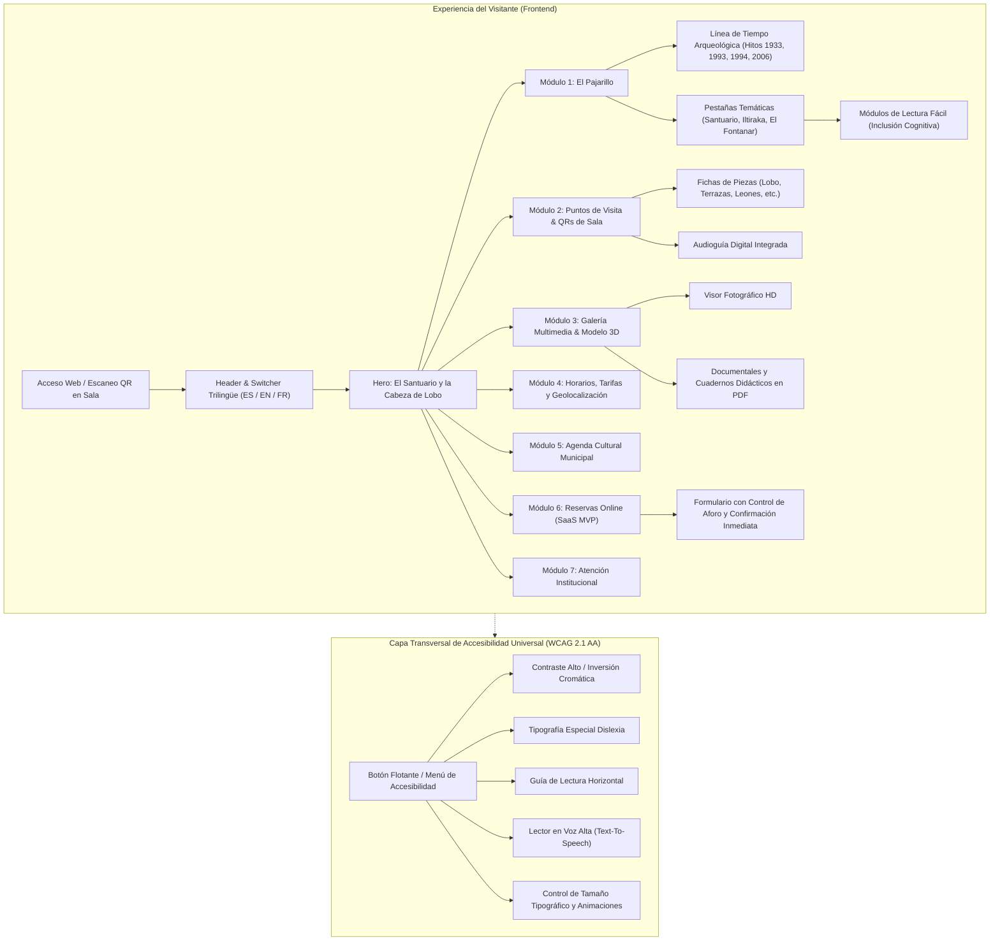
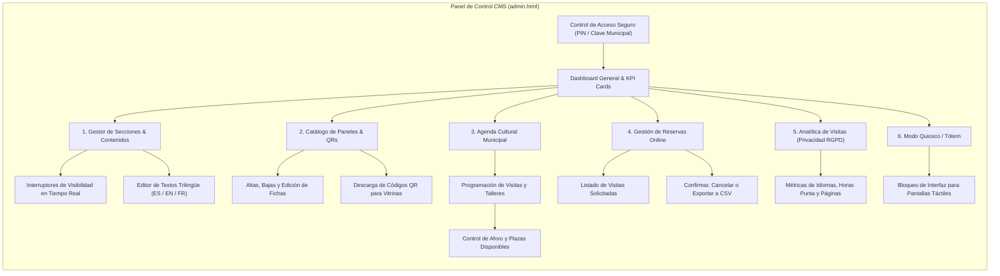
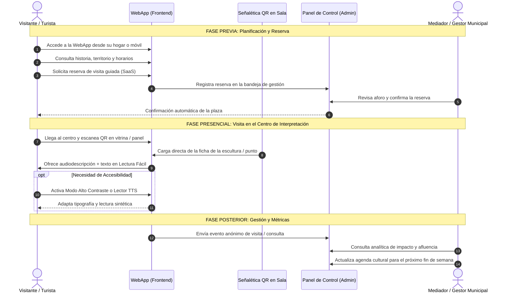

# PROYECTO MUSEOGRÁFICO: CENTRO DE INTERPRETACIÓN SANTUARIO IBÉRICO DE “EL PAJARILLO”
## Documento Técnico: Operatividad de la Plataforma Digital WebApp & Panel CMS

---

### 1. FICHA TÉCNICA DEL ENTORNO DIGITAL

| Parámetro | Especificación |
| :--- | :--- |
| **Denominación** | Plataforma Digital y Sistema de Mediación del Centro de Interpretación Santuario Ibérico de “El Pajarillo” |
| **Enclave Patrimonial** | Cortijo de El Pajarillo · Valle del Río Jandulilla (Huelma, Jaén). Bien de Interés Cultural (Decreto 12/2006). |
| **Discurso Museológico** | Monográfico Cultura Íbera: Santuario Heroico del Lobo, Territorio y Colonización de Iltiraka, Paisaje Sagrado y Camino Ritual El Pajarillo – El Fontanar. |
| **Entidad Promotora** | Ayuntamiento de Huelma · Concejalía de Patrimonio y Turismo |
| **Arquitectura de Software** | Single Page Application (SPA) modular, HTML5 Semántico, CSS3 Custom Properties, JavaScript ES6+ Vanilla (sin dependencias externas pesadas), motor i18n trilingüe y API REST local. |
| **Estándares de Accesibilidad** | Conforme a WCAG 2.1 Nivel AA y directrices UNE 153101:2018 EX de **Lectura Fácil**. |
| **Idiomas Oficiales** | Español (ES), Inglés (EN) y Francés (FR). |

---

### 2. ESTRUCTURA Y OPERATIVIDAD DEL FRONTEND (MÓDULO VISITANTE)

El Frontend ha sido concebido como una herramienta bidireccional: funciona como **portal web de captación y planificación previa**, como **audioguía interactiva presencial en sala/yacimiento**, y como **soporte multimedia adaptativo** para dispositivos móviles y tótems de sala.

#### 2.1. Desglose Operativo de las Secciones
1. **Cabecera y Navegación Adaptativa:**
   - Menú responsive con acceso inmediato a *"El Pajarillo"*, *"Puntos de Visita"*, *"Galería y Recursos"*, *"Horarios y Visita"*, *"Agenda Cultural"*, *"Contacto"* y botón directo *"Reservar Visita"*.
   - Conmutador de idioma dinámico instantáneo (sin recarga de página) entre Castellano, English y Français.
2. **Bloque Temático “El Pajarillo”:**
   - **Evolución Histórica y Arqueológica:** Cronología visual con los 6 hitos fundacionales (siglos VI-IV a.n.e., descubrimientos de 1933 y 1993, excavación de 1994 por Molinos, Ruiz, Chapa y Pereira, y declaración BIC 2006).
   - **Discurso Museográfico Tríptico:**
     - *Santuario Heroico:* Monumento en terrazas y combate mítico del Héroe contra el Lobo.
     - *Territorio de Iltiraka:* Colonización de la *silva* (bosque salvaje) del Jandulilla y legitimación del clan.
     - *Paisaje Sagrado y El Fontanar:* Conexión procesional de dos santuarios mediante el camino ritual.
   - **Lectura Fácil:** Cada bloque temático integra una tarjeta normalizada de fácil asimilación para público infantil, personas mayores o visitantes con diversidad cognitiva o barreras lingüísticas.
3. **Puntos de Información y Señalética QR:**
   - Catálogo interactivo de estaciones con opción de audiodescripción, ficha técnica y generador modal de Código QR con color corporativo para impresión inmediata por el personal del centro.
4. **Reserva Online de Visitas Guiadas (SaaS MVP):**
   - Selector de turnos (mañanas y tardes), cupo limitado a 25 personas por turno, campos de accesibilidad especial y confirmación con almacenamiento bidireccional (API REST local y almacenamiento en navegador para funcionamiento *offline* o en zonas con cobertura irregular).
5. **Atención al Visitante:**
   - Espacio institucional centralizado con teléfonos directos, correo de turismo, horarios de oficina y vinculación con la Concejalía de Turismo del Ayuntamiento de Huelma, omitiendo formularios redundantes con el de reserva.
6. **Widget de Accesibilidad Universal:**
   - Conforme a WCAG 2.1 Nivel AA. Control de tamaño de letra, tipografía para dislexia, guía de lectura visual para problemas de concentración, lector en voz alta multilingüe con Web Speech API y paletas de alto contraste o inversión cromática adaptativa.

---

### 3. ESTRUCTURA Y OPERATIVIDAD DEL PANEL DE ADMINISTRACIÓN (CMS SaaS)

El Panel de Control (`admin.html`) permite a los técnicos municipales de patrimonio y turismo gestionar de manera autónoma todos los activos digitales del museo sin requerir conocimientos de programación.

#### 3.1. Funcionalidades Clave del CMS
1. **Control de Secciones en Tiempo Real:** Los técnicos pueden ocultar o mostrar secciones completas de la web mediante interruptores inmediatos que sincronizan con el frontend a través del `localStorage` y la API de configuración.
2. **Editor de Textos y Contenidos Multilingüe:** Permite modificar los textos del Santuario, Territorio de Iltiraka, horarios de invierno/verano, tarifas y datos de contacto en los tres idiomas simultáneamente.
3. **Gestor de Paneles y Descargador de Señalética:** Permite agregar nuevos puntos expositivos y generar en un clic el código QR en alta resolución para colocar en vitrinas o paneles físicos de la sala.
4. **Bandeja de Reservas y Gestión de Grupos:** Permite revisar las reservas que entran por la web, filtrarlas por fecha o estado (Pendiente, Confirmada, Cancelada) y exportar los listados para los guías del centro.
5. **Analítica de Audiencias Soberana (First-Party):** Mide visitas, tiempos de lectura e idiomas preferidos sin rastreadores invasivos de terceros, respetando rigurosamente el RGPD.
6. **Modo Quiosco / Terminal Interactivo:** Transforma la aplicación en un entorno cerrado para su uso en pantallas táctiles y tótems de sala en el propio centro de interpretación, evitando salidas accidentales del navegador.

---

### 4. DIAGRAMA DE FLUJO GENERAL DE OPERACIÓN MUSEOGRÁFICA

A continuación se esquematiza el ciclo integral de interacción entre el visitante, la plataforma digital, la señalética física y el equipo de gestión municipal:

---

### 5. CONCLUSIÓN Y VALOR PARA EL PROYECTO MUSEOGRÁFICO

La plataforma digital implementada proporciona:
1. **Fidelidad Histórico-Arqueológica Absoluta:** Un discurso centrado al 100% en la cultura ibérica, el santuario heroico de El Pajarillo, la colonización territorial de Iltiraka y el paisaje sagrado del río Jandulilla.
2. **Inclusión y Accesibilidad Universal:** Cumplimiento de los máximos estándares de accesibilidad digital (WCAG 2.1 AA) e inclusión cognitiva (Lectura Fácil) pionera en la comarca de Sierra Mágina.
3. **Autonomía Municipal y Sostenibilidad:** Un panel de administración ágil y modular que permite mantener vivo el centro de interpretación, gestionar visitas guiadas y evaluar el impacto turístico sin dependencias tecnológicas externas.
